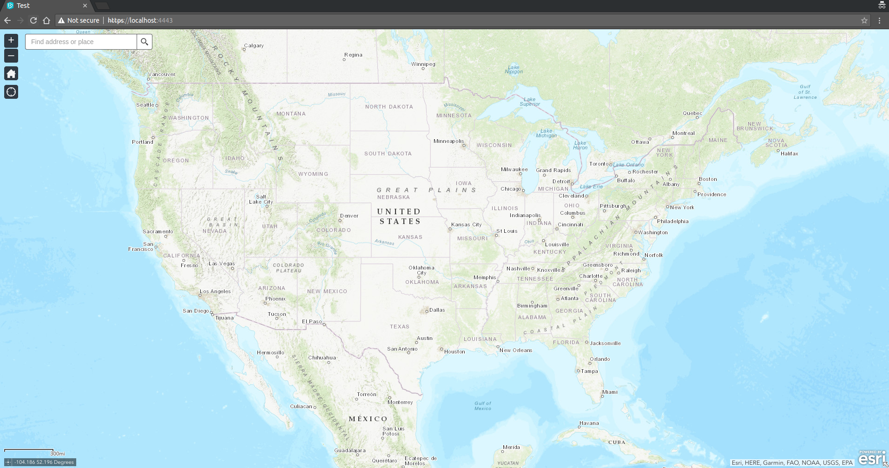

# Integrating Modeling and Forecasting with R

## Frontend Creation
### Creating a Blank Web AppBuilder App
*Note: you can skip this step by simply downloading this repository*
- If you don't have it already, install [node.js](https://nodejs.org/en/download/)
- Download the latest version of [Web AppBuilder for ArcGIS](https://developers.arcgis.com/web-appbuilder/)
- Unzip and open a terminal in the resulting directory
- `cd server`
- `npm install`
- `npm run start`
- Open a browser to the page that is served up - in this case, `localhost:3346`.
- Enter the URL for your ArcGIS Online Portal (in our case, `http://scientifics.maps.arcgis.com/`)
- It will now ask for an App ID - click "Help" and follow the instructions laid out there. For the URL, use `http://localhost:3346/webappbuilder`.
- When it is created, go to "Settings -> App Registration" to register an ID, using the same URL as the redirect.
	- Alternatively: Back on your localhost page, create a default 2D web map and save it. Navigate back to the main page, find the map you just made, and save it.
	- Unzip it to a directory.

### Run the Frontend App
- Option 1: Simply copy all of these files to a server somewhere and host them online to access.
- Option 2: Start a local https server:
	- First generate a self-signed SSL certificate to enable HTTPS:
	`openssl req -new -x509 -keyout server.pem -out server.pem -days 365 -nodes`
	- Run `python3 server.py` (note: this does require python 3) and navigate to `https://localhost:8000/`
- You may get an "unsafe connection", this can be bypassed for testing purposes. You should now be able to see a basic webmap: 

### Add a Custom Widget
- Install the widget generator with `npm install -g yo generator-esri-appbuilder-js`
- Make a new directory for your project and run `yo esri-appbuilder-js` to generate some initial files and set some settings.
- Run `yo esri-appbuilder-js:widget` to create your actual widget in the `./widgets` directory. This will provide the basic scaffolding around which a full widget can be built.
- Copy your new widget back into your app's widget directory. For us, this will be under `widgets/RIntegration`

## Backend Creation

- Install R, by either following the instructions at one of the [websites](https://cran.r-project.org/) or
	- On unix variants, running something equivalent to `sudo apt-get install r-base` suffices. If you are on Ubuntu, you may need to follow a few more steps to get the latest version, [here is a walkthrough](https://www.digitalocean.com/community/tutorials/how-to-install-r-on-ubuntu-18-04-quickstart).
- (Optional) Install [RStudio](https://www.rstudio.com/products/rstudio/download/).
- Install the [plumber](https://www.rplumber.io/) package:
	- Launch R from the command line by typing `R` (or launch RStudio), and at the prompt, install  *plumber* package by typing `install.packages('plumber')`.
- Now you can set up a test endpoint. Here is an example:
	```R
	# In a file such as 'test.R'

	#* @get /sum
	function(a, b) {
		return(a + b)
	}

	# In a separate file such as 'server.R' or in the R command prompt
	library(plumber)
	r <- plumb('test.R') 	# The file made above
	r$run(port=8000) 	# Any free port
	```
	After entering these commands or sourcing `server.R`, you can now visit something like [http://localhost:8000/sum?a=1&b=2](http://localhost:8000/sum?a=1&b=2) in your browser to test the results.
